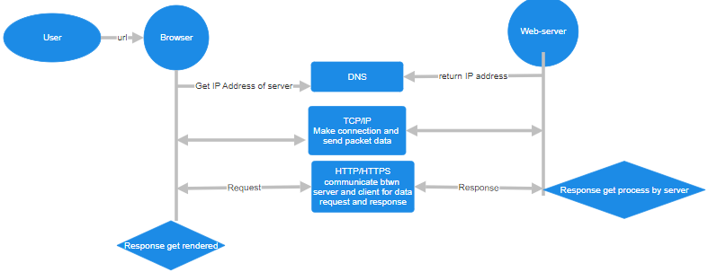
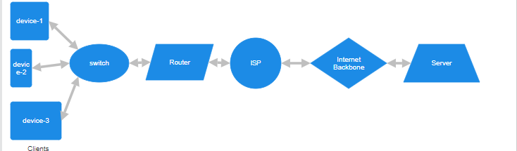

# How Internet Works?

## History of Internet

1. **1960s: Foundations**

   - **ARPANET:** The internet's origins trace back to ARPANET, developed by the U.S. Department of Defense's Advanced Research Projects Agency (ARPA). The first message was sent over ARPANET in 1969 between UCLA and Stanford Research Institute.
   - **Packet Switching:** The concept of packet switching, which breaks data into packets and sends them independently, was introduced by Paul Baran and Donald Davies.

2. **1970s: Development of Protocols**

   - **TCP/IP:** In 1974, Vint Cerf and Bob Kahn published the Transmission Control Protocol (TCP) and Internet Protocol (IP), which became the foundational protocols for internet communication.
   - **Expansion:** By the late 1970s, ARPANET connected multiple universities and research institutions.

3. 1980s: The Birth of the Modern Internet

   - **NSFNET:** The National Science Foundation created NSFNET in 1985, connecting supercomputing centers and leading to the commercial expansion of the internet.
   - **Domain Name System (DNS):** Introduced in 1983, DNS allowed users to access websites using easy-to-remember domain names instead of numerical IP addresses.

4. **1990s: The World Wide Web**

   - **HTML and HTTP:** Tim Berners-Lee developed HTML (HyperText Markup Language) and HTTP (HyperText Transfer Protocol), creating the World Wide Web (WWW) in 1991.
   - **Browsers:** The release of web browsers, such as Mosaic (1993) and Netscape Navigator (1994), made the web more accessible to the general public.

5. **2000s: Growth and Commercialization**

   - **Broadband:** The widespread adoption of broadband internet significantly increased access speed and the number of internet users.
   - **Social Media:** Platforms like Facebook (2004), YouTube (2005), and Twitter (2006) transformed how people communicate and share information.

6. **2010s: Mobile and Cloud Computing**

   - **Smartphones:** The introduction of smartphones and mobile apps revolutionized internet access and usage.
   - **Cloud Services:** Cloud computing services like Amazon Web Services (AWS) and Google Cloud became mainstream, allowing businesses and individuals to store and process data online.

7. **2020s: Current Trends**

   - **5G and IoT:** The rollout of 5G networks and the Internet of Things (IoT) has led to faster connectivity and the proliferation of connected devices.
   - **Cybersecurity and Privacy Concerns:** Increased reliance on the internet has raised concerns over data privacy and security, prompting regulatory measures.

   ***

##  What is Internet

The internet is a vast network of computers and devices that are interconnected across the world, allowing them to share data and communicate.

---

# Web Request and Response Flowchart Breakdown:

##  1. Client (Browser) Request

- **Start**: User types `www.example.com` into the browser's address bar and hits Enter.
- **DNS Lookup**: Browser sends a request to DNS to get the IP address of `www.example.com`. If it's cached (previously resolved), the browser will use the cached IP address.
- **IP Address Found**: Once DNS returns the IP address (e.g., `192.0.2.1`), the browser proceeds to the next step.

## 2. Establish Connection

- **TCP Handshake**: The browser establishes a connection to the server using the TCP/IP protocol. This involves a three-way handshake:
  - Client sends a **SYN** (synchronize) packet to the server.
  - Server responds with a **SYN-ACK** (synchronize-acknowledge) packet.
  - Client sends an **ACK** (acknowledge) packet back, completing the handshake.

## 3. HTTP Request Sent

- **Send HTTP/HTTPS Request**: The browser sends an HTTP request (GET request) to the server at `192.0.2.1`, asking for the webpage data. If the site uses HTTPS (secure), an SSL handshake occurs before this to encrypt the communication.

## 4. Server Processes Request

- **Request Received by Web Server**: The server (e.g., Nginx, Apache) receives the request and processes it. It forwards the request to the appropriate backend (such as a PHP or Node.js application) or fetches static content (e.g., HTML, CSS, JavaScript files).
- **Database Query (if needed)**: If the webpage involves dynamic content, the server might query the database (e.g., MySQL, MongoDB) to retrieve or manipulate data.

## 5. HTTP Response Prepared

- **Data Packaged in Response**: The server prepares the response. This could be HTML data, media files (images, videos), or a JSON response (if it’s an API request).
- **HTTP Headers Added**: The server attaches necessary HTTP headers (e.g., status code 200 OK, content type, caching policies).
- **Response Sent**: The server sends the HTTP response back to the client.

## 6. Response Reaches Browser

- **Data Packets Routed**: The response (divided into data packets) travels through the network infrastructure (routers, switches, ISPs) back to the client.
- **Browser Receives Packets**: The browser reassembles the data packets into the complete HTTP response.

## 7. Render Webpage

- **Content Rendering**: The browser processes the received HTML file. If the file references CSS, JavaScript, or images, the browser makes additional requests for these resources.
- **DOM Creation**: The browser builds the DOM (Document Object Model), applying styles and executing scripts to fully render the page for the user.

## FlowChart

---

# Key conponents of Web

## 1. Client

- **What it is**: The client refers to the device or application (typically a web browser like Chrome, Firefox, etc.) that initiates a request to retrieve resources (webpages, files, data) from a server.
- **Role**: The client sends an HTTP/HTTPS request to the server, asking for a specific resource, like a webpage or file. The client also receives the server’s response and renders it (if it's a browser).
- **Example**: A user enters "www.example.com" in the address bar of the browser.

## 2. Browser

- **What it is**: A web browser is an application that allows users to interact with web pages and web applications. It processes requests and renders content received from a server.
- **Role**: The browser converts user inputs (like URLs) into requests, retrieves the response from a web server, and renders HTML, CSS, JavaScript to display the page.
- **Examples of Browsers**: Chrome, Firefox, Safari, Edge.

## 3. URL (Uniform Resource Locator)

- **What it is**: A URL is the address of a resource on the web.
- **Structure**: A URL consists of several components:
  - **Scheme/Protocol**: Specifies the protocol used, such as http:// or https://.
  - **Host/Domain Name**: Specifies the server's address (e.g., www.example.com).
  - **Port (optional)**: Defines the port number used by the server. Defaults are 80 for HTTP and 443 for HTTPS.
  - **Path**: Points to the resource on the server (e.g., /about).
  - **Query (optional)**: Provides additional data to the server (e.g., ?id=123).
- **Example**: `https://www.example.com/about?id=123`

## 4. DNS (Domain Name System)

- **What it is**: DNS is like the "phonebook" of the internet. It translates human-readable domain names (e.g., www.example.com) into IP addresses (e.g., 93.184.216.34) that computers use to identify each other on the network.
- **Role**: When the client enters a URL, the browser uses DNS to resolve the domain name into the corresponding IP address of the server hosting the website.
- **Example**: When you type www.example.com, DNS converts it to 93.184.216.34 (the server’s IP address).

## 5. IP Address (Internet Protocol Address)

- **What it is**: An IP address is a unique identifier for devices on a network. It is essential for routing data between devices over the internet.
- **Types**:
  - **IPv4**: Consists of four sets of numbers (e.g., 192.168.1.1).
  - **IPv6**: A more modern version that allows for more unique addresses (e.g., 2001:0db8:85a3:0000:0000:8a2e:0370:7334).
- **Role**: Once DNS resolves a domain to an IP address, the browser uses this IP to locate and communicate with the server.
- **Example**: www.example.com resolves to 93.184.216.34.

## 6. TCP/IP (Transmission Control Protocol/Internet Protocol)

- **What it is**: TCP/IP is the foundational communication protocol suite of the internet. <mark>**TCP ensures reliable, ordered, and error-checked data transmission**</mark>, while <mark>**IP handles addressing and routing the data to the correct destination.**</mark>
- **Key Steps in TCP/IP**:
  - **Data Segmentation**: TCP divides the data into small packets for transmission.
  - **Packet Transmission**: IP handles sending these packets across different networks.
  - **Reassembly**: TCP reassembles the packets on the receiving end and ensures no data is lost.
- **Role**: Every communication over the web uses TCP/IP to reliably transmit data between clients and servers.

## 7. HTTP/HTTPS Request (Hypertext Transfer Protocol)

- **What it is**: HTTP and HTTPS are the protocols used for communication between clients (browsers) and web servers.
  - **HTTP**: Transmits data in plain text.
  - **HTTPS**: Secures data transmission using encryption (SSL/TLS).
- **Structure of an HTTP/HTTPS Request**:
  - **Method**: The type of request (e.g., GET, POST, PUT, DELETE).
  - **URL**: The resource being requested.
  - **Headers**: Metadata, such as the browser type, cookies, and accepted formats.
  - **Body (optional)**: Data sent in the request, often in POST requests.
- **Example**: The browser sends a GET request to `https://www.example.com/about`.

## 8. Server

- **What it is**: A server is a powerful computer that stores, processes, and delivers web content to clients via HTTP/HTTPS.
- **Role**: Once the server receives a request, it processes the request, retrieves the appropriate resource (like an HTML page, file, or data), and sends the response back to the client.
- **Examples of Servers**: Nginx, Apache, IIS.

## 9. HTTP/HTTPS Response

- **What it is**: The server's response to a client's request, which contains the requested data (like an HTML page or API data) and metadata about the response.
- **Structure of an HTTP/HTTPS Response**:
  - **Status Code**: Indicates the success or failure of the request (e.g., 200 OK, 404 Not Found).
  - **Headers**: Information about the response (e.g., content type, caching instructions).
  - **Body**: The requested resource (e.g., HTML, JSON, image, etc.).
- **Example**: The server responds with 200 OK and sends back an HTML webpage.

## 10. Rendering

- **What it is**: Rendering refers to the process of interpreting and displaying the content (HTML, CSS, JavaScript) received from the server in the browser.
- **Role**:
  - **HTML Rendering**: The browser converts HTML into the Document Object Model (DOM), which represents the structure of the page.
  - **CSS Application**: The browser applies styles to elements based on CSS rules.
  - **JavaScript Execution**: JavaScript is executed to add interactivity and dynamic behavior to the page.
- **Example**: After receiving the HTML, CSS, and JavaScript, the browser displays the final webpage that the user interacts with.

---

# Physical Infrastructure of Internet

##  1. Host

A host is any device that connects to a network and can send or receive data. Hosts can be classified into two main categories:

**Client**: A client is a device that requests services from a server. Examples include personal computers, smartphones, and tablets. Clients initiate communication and typically run client-side applications like web browsers to access services hosted on servers.

**Server**: A server is a device that provides resources or services to clients over a network. Servers can host websites, databases, applications, or files. Examples include web servers (e.g., Apache, Nginx), database servers (e.g., MySQL, MongoDB), and file servers.

##  2. Switch

A switch is a networking device that connects devices within a Local Area Network (LAN). It receives incoming data packets and redirects them to their destination on the local network.

**Functionality**:

- Operates at the Data Link layer (Layer 2) of the OSI model.
- Uses MAC addresses to forward data only to the intended devices, improving network efficiency.
- Reduces collisions and increases bandwidth within the network.

##  3. Router

A router is a device that forwards data packets between different networks, directing traffic on the Internet. It connects multiple networks, such as a local network to the Internet, and manages the flow of data between them.

**Functionality**:

- Operates at the Network layer (Layer 3) of the OSI model.
- Uses IP addresses to determine the best path for data to travel.
- Can provide additional features like Network Address Translation (NAT), firewall protection, and DHCP.

##  5. Internet Service Provider (ISP)

An ISP is a company that provides individuals and organizations with access to the Internet. ISPs can be commercial, nonprofit, or community-owned.

**Functions**:

- Supplies internet connectivity via various technologies (DSL, cable, fiber, satellite).
- Provides related services such as web hosting, email, and domain registration.
- Acts as a gateway between users and the broader Internet.

##  6. Internet Backbone

The Internet backbone refers to the principal data routes and high-capacity networks that form the core of the Internet. It consists of a collection of high-speed fiber optic cables and routers operated by large telecommunications companies.

**Characteristics**:

- Handles a large volume of data traffic between different networks.
- Connects regional and local networks to enable global connectivity.
- Provides high-speed and reliable data transmission.

##  7. Wide Area Network (WAN)

A WAN is a telecommunications network that extends over a large geographical area, connecting multiple LANs. It can span cities, countries, or even continents.

**Characteristics**:

- Typically slower than LANs due to the distance and technologies used (e.g., leased lines, satellite links).
- Enables long-distance communication and resource sharing.
- Often managed by multiple organizations or service providers.

##  8. Modem

A modem (modulator-demodulator) is a device that converts digital data from a computer into an analog signal for transmission over telephone lines (or vice versa).

**Functions**:

- Enables internet connectivity by connecting a computer or network to an ISP.
- Types include DSL modems, cable modems, and fiber modems, depending on the type of internet service.

##  9. Firewall

A firewall is a network security device that monitors and controls incoming and outgoing network traffic based on predetermined security rules.

**Functions**:

- Protects networks from unauthorized access and cyber threats.
- Can be hardware-based or software-based, often integrated into routers.

##  10. Access Point (AP)

An access point is a networking hardware device that allows wireless devices to connect to a wired network using Wi-Fi or other standards.

**Functions**:

- Extends the coverage area of a LAN.
- Provides connectivity for devices like laptops, smartphones, and tablets.

## Flowchart

## Youtube Video

[how internet works](https://www.youtube.com/watch?v=sMHzfigUxz4&t=188s)
