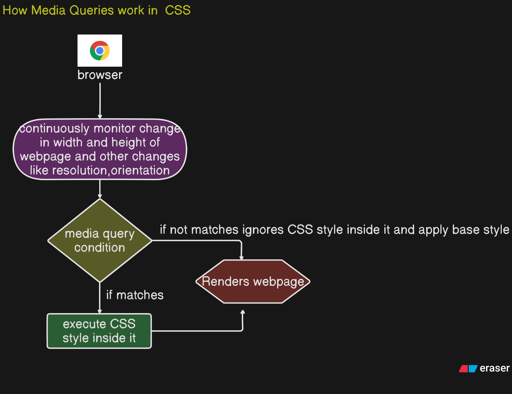

# <span style="color:yellow">**Media Query in CSS**</span>

## 1. What are Media Queries?

Media queries are **CSS rules that apply styles conditionally** — depending on device features (like screen width, height, orientation, or resolution).

👉 They make your website **responsive** — adapting layout for mobile, tablet, and desktop.

---

## 2. How Do They Work?

- You set **conditions** (e.g., "if screen width ≤ 600px").
- CSS inside that query **applies only when the condition is true**.
- If false → that CSS is ignored.

👉 Browser constantly checks the viewport size → when you resize or rotate, media queries can **turn styles on/off automatically**.

---

## 3. Syntax of Media Query

```css
@media (condition) {
  /* CSS rules that apply only when condition is true */
}
```

### Examples:

```css
/* Apply when screen width is 600px or less */
@media (max-width: 600px) {
  body {
    background-color: lightblue;
  }
}

/* Apply when screen width is 601px or more */
@media (min-width: 601px) {
  body {
    background-color: lightgreen;
  }
}
```

---

## 4. Analogy

Think of media queries like **clothes in your wardrobe** 👕👗:

- You don’t wear the same clothes everywhere.
- **Hot day** → you choose a t-shirt.
- **Cold day** → you choose a jacket.
- **Party** → you wear something stylish.

👉 Similarly, websites “wear” different CSS styles based on the **situation (screen size, device)**.

---

## 5. Example Use Cases

✅ **Mobile-first design**

```css
@media (max-width: 768px) {
  nav ul {
    flex-direction: column; /* stack menu items vertically on small screens */
  }
}
```

✅ **Different font sizes per device**

```css
@media (max-width: 480px) {
  h1 {
    font-size: 1.5rem;
  }
}

@media (min-width: 1024px) {
  h1 {
    font-size: 3rem;
  }
}
```

✅ **Portrait vs Landscape**

```css
@media (orientation: portrait) {
  body {
    background: lightpink;
  }
}
@media (orientation: landscape) {
  body {
    background: lightyellow;
  }
}
```

---

## 6. Best Practices

- Start with **mobile-first CSS** (base styles) and use `min-width` queries to scale up.
- Keep breakpoints logical (e.g., 480px, 768px, 1024px, 1200px).
- Avoid writing too many queries — group styles smartly.

---

## Quick Template

```css
/* Base styles (mobile-first) */
body {
  font-size: 16px;
}

/* Tablet */
@media (min-width: 768px) {
  body {
    font-size: 18px;
  }
}

/* Desktop */
@media (min-width: 1024px) {
  body {
    font-size: 20px;
  }
}
```

---

👉 So in short:

- **Media queries = conditional CSS based on device/screen**.
- **Analogy**: Like picking outfits depending on weather.
- They power **responsive web design**.

---

## **Media Query Working**



---

## 1. What is **Mobile-First Design Approach**?

- It means you **start designing your website for small screens (mobile)** and then progressively enhance for larger screens (tablet, desktop).
- In CSS, you write **base styles for mobile** → then use **`@media (min-width: …)` queries** to add/adjust styles for bigger devices.

👉 The opposite is **Desktop-First** (design for large screens and then shrink down using `max-width` queries).

---

## 2. Why Bottom-Up Approach (Mobile → Desktop)?

✅ **Performance first**: Mobile users usually have slower networks → lighter base styles load fast.
✅ **Progressive enhancement**: Every browser/device at least gets a usable mobile version.
✅ **Ease of scaling**: It’s easier to add complexity (grids, sidebars) for bigger screens than stripping features away.
✅ **Industry standard**: Most modern frameworks (Bootstrap, Tailwind) follow **mobile-first**.

👉 Analogy: It’s like **building a house**: start with a small strong foundation (mobile), then extend rooms and floors (tablet/desktop).

---

## 3. What is **Base Styling**?

- Base styling = the **default CSS rules** that apply **without any media queries**.
- These rules are optimized for **smallest screen size (mobile)**.
- It usually includes:

  - Typography (font size, line-height)
  - Layout (single column, stacked items)
  - Buttons, forms, links

👉 Think of base styling as **the “bare minimum outfit”** you always wear (like a T-shirt). Media queries then add layers (jacket for cold, accessories for party).

---

## 4. Breakpoints in Media Queries

- **Breakpoints** = screen width values where your design/layout needs to change.
- Example: At 768px, you switch from mobile view (stacked nav) to tablet view (inline nav).

👉 Use **min-width breakpoints** in mobile-first design.

---

## 5. Common Breakpoints (Industry Standard)

Here are widely used breakpoints (but can be adjusted per project):

| Device Type                          | Breakpoint (width)  | Example Usage                                          |
| ------------------------------------ | ------------------- | ------------------------------------------------------ |
| **Small Mobile**                     | `max-width: 480px`  | Extra-small phones, adjust font size, stack everything |
| **Mobile (default base)**            | `min-width: 480px`  | Base mobile design (no query needed if mobile-first)   |
| **Tablet Portrait**                  | `min-width: 768px`  | Change to multi-column layouts, nav bar inline         |
| **Tablet Landscape / Small Laptops** | `min-width: 1024px` | Increase font sizes, wider layouts, sidebars           |
| **Desktop**                          | `min-width: 1200px` | Add grids, large spacing, complex UI                   |
| **Large Screens**                    | `min-width: 1440px` | High-res monitors, extra padding, wide layouts         |

---

## 6. Example Code (Mobile-First with Breakpoints)

```css
/* Base styling (mobile first) */
body {
  font-size: 16px;
  padding: 10px;
}

/* Tablet */
@media (min-width: 768px) {
  body {
    font-size: 18px;
    padding: 20px;
  }
}

/* Desktop */
@media (min-width: 1024px) {
  body {
    font-size: 20px;
    padding: 40px;
  }
}
```

👉 Here:

- Mobile (default) = 16px
- Tablet = 18px
- Desktop = 20px

---

✅ So in short:

- **Mobile-first** = start small, scale up.
- **Bottom-up** ensures performance + flexibility.
- **Base styling** = default mobile styles.
- **Breakpoints** = screen widths where layout changes.

---

Perfect 👌 this is deep-dive territory! Let’s go step by step — first **all media query conditions**, then **device-based breakpoints**, and finally **framework-specific breakpoints**.

---

## 1. Media Query Conditions & Properties

Media queries check certain **media features** of the user’s device/environment.
Here are the key ones:

| Media Feature              | Meaning                                       | Example                                   |
| -------------------------- | --------------------------------------------- | ----------------------------------------- |
| **width**                  | Viewport width                                | `@media (max-width: 768px)`               |
| **min-width / max-width**  | Min/max viewport width                        | `@media (min-width: 1024px)`              |
| **height**                 | Viewport height                               | `@media (max-height: 600px)`              |
| **orientation**            | Portrait or landscape                         | `@media (orientation: portrait)`          |
| **aspect-ratio**           | Width\:height ratio                           | `@media (aspect-ratio: 16/9)`             |
| **resolution**             | Screen resolution (dpi/dppx)                  | `@media (min-resolution: 2dppx)` (retina) |
| **color**                  | # of bits per color                           | `@media (min-color: 8)`                   |
| **pointer**                | Input type (coarse = touch, fine = mouse)     | `@media (pointer: coarse)`                |
| **hover**                  | Whether device supports hover                 | `@media (hover: hover)`                   |
| **prefers-color-scheme**   | Dark or light mode                            | `@media (prefers-color-scheme: dark)`     |
| **prefers-reduced-motion** | Motion reduction accessibility                | `@media (prefers-reduced-motion: reduce)` |
| **display-mode**           | PWA mode (fullscreen, standalone, minimal-ui) | `@media (display-mode: fullscreen)`       |
| **grid**                   | Device is grid vs bitmap                      | Rarely used                               |
| **monochrome**             | Monochrome device check                       | Rarely used                               |

👉 The most common ones in **responsive design** are:

- `width`, `min-width`, `max-width`
- `orientation`
- `resolution` (for retina images)
- `prefers-color-scheme`

---

## 2. Device-Based Breakpoint Values

Here’s a practical **reference chart** for device sizes:

| Device                              | Breakpoint    | Notes                            |
| ----------------------------------- | ------------- | -------------------------------- |
| Extra-small phones                  | `0–480px`     | Old phones / very small screens  |
| Mobile phones                       | `481–767px`   | Most smartphones                 |
| Tablets (portrait)                  | `768–1023px`  | iPad portrait, mid-range tablets |
| Tablets (landscape) / small laptops | `1024–1279px` | iPad landscape, small notebooks  |
| Desktops                            | `1280–1439px` | Standard desktop/laptop          |
| Large desktops / wide screens       | `1440px+`     | 1080p+, 2K, 4K monitors          |

👉 You typically don’t hardcode every device — instead, use **general ranges** like 480, 768, 1024, 1200, 1440.

---

## 3. Framework Breakpoints

Each CSS framework defines its own **breakpoint system** (often mobile-first). Let’s compare:

### 🔸 Bootstrap 5

```css
/* Extra small (default) */
< 576px

/* Small devices */
@media (min-width: 576px)

/* Medium devices */
@media (min-width: 768px)

/* Large devices */
@media (min-width: 992px)

/* Extra large */
@media (min-width: 1200px)

/* XXL */
@media (min-width: 1400px)
```

---

### 🔸 Tailwind CSS (default config)

```css
/* Mobile-first (no query) */

/* Small (sm) */
@media (min-width: 640px) /* Medium (md) */ @media (min-width: 768px) /* Large (lg) */ @media (min-width: 1024px) /* Extra-large (xl) */ @media (min-width: 1280px) /* 2XL */ @media (min-width: 1536px);
```

---

### 🔸 Materialize

```css
/* Small */
@media (max-width: 600px) /* Medium */ @media (min-width: 601px) and (max-width: 992px) /* Large */ @media (min-width: 993px);
```

---

### 🔸 Foundation

```css
/* Small */
@media (max-width: 639px) /* Medium */ @media (min-width: 640px) and (max-width: 1023px) /* Large */ @media (min-width: 1024px);
```

---

## 4. Best Practices for Breakpoints

- Don’t chase every device → design for **content needs** (when layout breaks).
- Stick to **4–5 breakpoints** max.
- Use **min-width** for mobile-first.
- Example common set:

  - 480px (phones)
  - 768px (tablets)
  - 1024px (small laptops)
  - 1200px (desktop)
  - 1440px (large screens)

---

✅ So in short:

- Media queries check properties like `width`, `orientation`, `resolution`, `hover`, etc.
- Breakpoints = width ranges where layout changes.
- Frameworks like Bootstrap/Tailwind define their own standard breakpoints.

---
